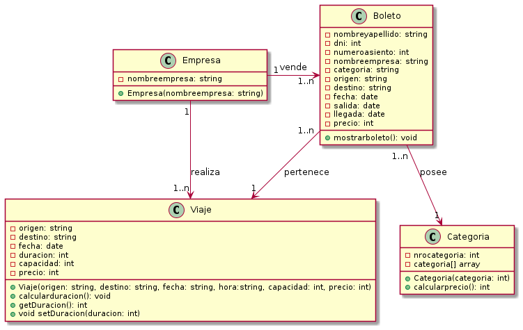

# Actividad grupal 2

Modelar un sistema para consulta de viajes de ómnibus simple, identifique clases, atributos y asociaciones.

- Los viajes tienen una ciudad de origen y otra de destino, se realizan en determinadas fechas y poseen cierta duración
- El precio del boleto depende de la categoría.
- Cada viaje lo realiza una empresa en particular
- Utilice UML

